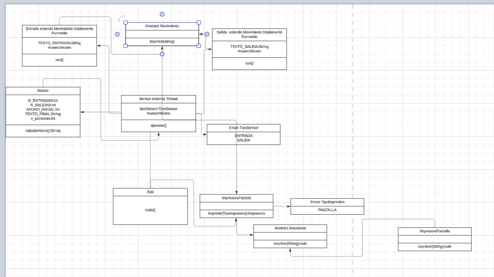

# Museo

## Diseño

## Comentarios
Planteado sin wait ni notify, con locks. Se ha optado finalmente porque el método imprimir lo tenga el museo y no la clase padre de los hilos, aun así debido a la logica de diseño, al ser movimientos, tanto salida como entrada, esa clase se mantiene
